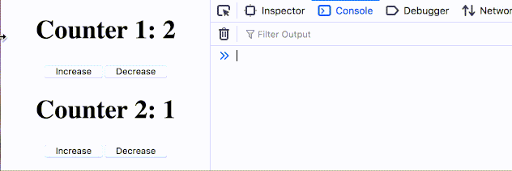
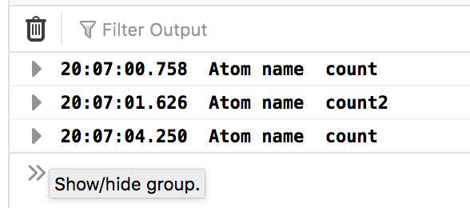
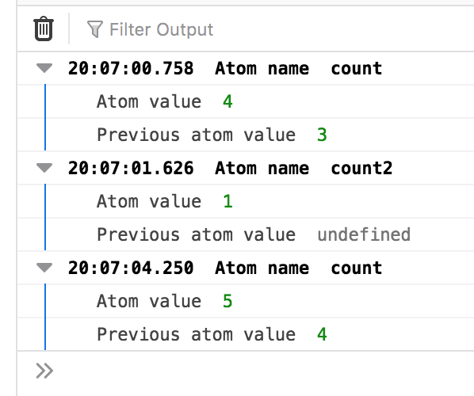

# Recoil-logger

Logger for state manager [recoil](https://recoiljs.org)



```js
import React from 'react';
import ReactDOM from 'react-dom';
import App from './App';
import { RecoilRoot } from "recoil";
import RecoilLogger from 'recoil-logger'

ReactDOM.render(
  <React.StrictMode>
    <RecoilRoot>
      <App />
      <RecoilLogger />
    </RecoilRoot>
  </React.StrictMode>,
  document.getElementById('root')
);
```

## Install

```
npm install --save-dev recoil-logger
```
or
```
yarn add --dev recoil-logger
```

Now you could add `RecoilLogger` to your app:

```js
import React from 'react';
import ReactDOM from 'react-dom';
import App from './App';
import { RecoilRoot } from "recoil";
import RecoilLogger from 'recoil-logger'

ReactDOM.render(
  <React.StrictMode>
    <RecoilRoot>
+      <RecoilLogger /> {/* Please add this line inside `RecoilRoot` scope */}
      <App />
    </RecoilRoot>
  </React.StrictMode>,
  document.getElementById('root')
);
```

After this you can see the events on **each** atom in browser's console:



But to see the values you need to add `persistence_UNSTABLE` key to atom properties:

```js
const counterState = atom({
  key: "count",
  default: 0,
+  persistence_UNSTABLE: {
+    type: 'log'
+  },
});
```

The key `type` can has any value but not `none` (by default it is `none`).



## Notes

This package use unstable hook `useTransactionObservation_UNSTABLE`. 
As far it will be stable the package will be updated with new API.

